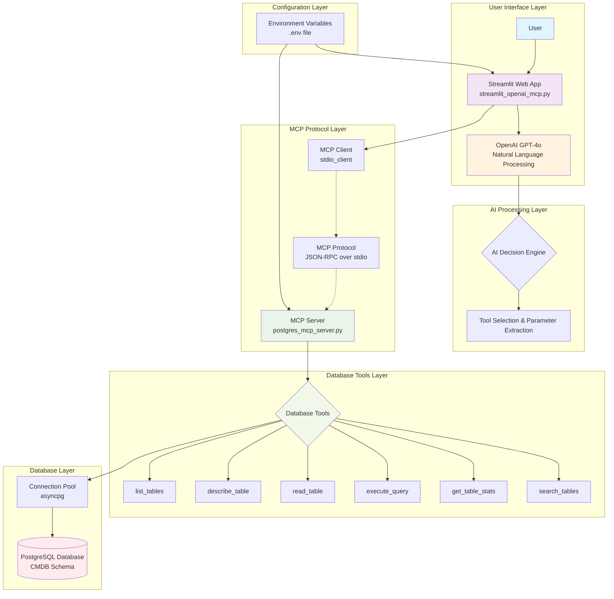
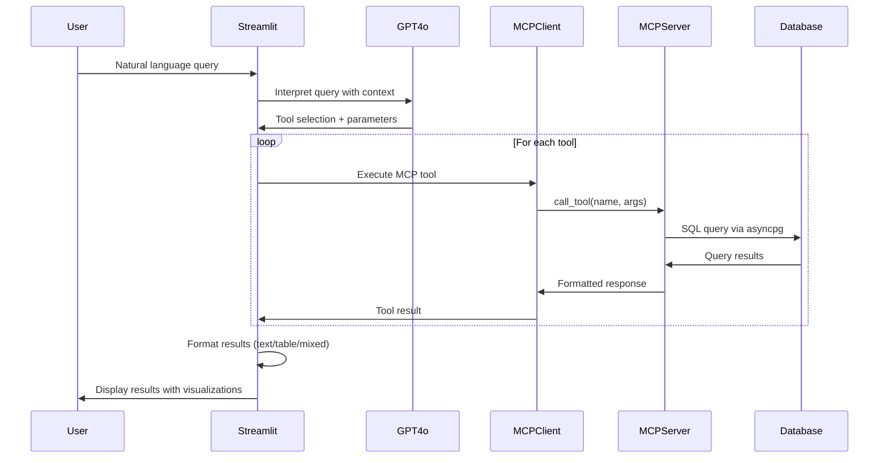
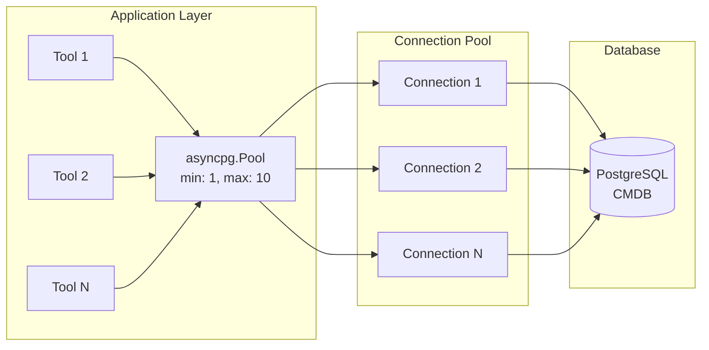

# Architecture Documentation

## System Overview

This project implements a comprehensive database interaction system using the Model Context Protocol (MCP) to enable AI assistants to query and analyze PostgreSQL databases through natural language. The system consists of three main components working together to provide an intelligent database interface.

## Architecture Diagram

## Component Architecture

### 1. User Interface Layer

**Streamlit Web Application** (`streamlit_openai_mcp.py`)
- **Technology**: Streamlit framework with Python
- **Purpose**: Provides conversational web interface for database queries
- **Key Features**:
  - Natural language input processing
  - Real-time chat interface with conversation history
  - Rich data visualization (tables, metrics, charts)
  - CSV export functionality
  - Example query suggestions
  - Configuration panel with database/API status

### 2. AI Processing Layer

**OpenAI GPT-4o Integration**
- **Technology**: OpenAI API with GPT-4o model
- **Purpose**: Interprets natural language and maps to database operations
- **Processing Flow**:
  1. Receives user's natural language query
  2. Analyzes intent using conversation context
  3. Determines appropriate MCP tools to call
  4. Extracts parameters for tool execution
  5. Formats results for user presentation

### 3. MCP Protocol Layer

**MCP Client** (Streamlit Integration)
- **Technology**: Official MCP Python client with stdio transport
- **Purpose**: Handles communication with MCP server
- **Features**:
  - Asynchronous tool execution
  - Session management and initialization
  - Error handling and retry logic
  - Process lifecycle management

**MCP Server** (`postgres_mcp_server.py`)
- **Technology**: FastMCP framework (transitioning to official MCP SDK)
- **Purpose**: Exposes database operations as standardized MCP tools
- **Protocol Compliance**:
  - Tool discovery via `list_tools()`
  - Tool execution via `call_tool()`
  - Structured JSON schemas for all tools
  - Error handling with user-friendly messages

### 4. Database Tools Layer

The MCP server implements six core database tools:

| Tool | Purpose | Input Parameters | Output Format |
|------|---------|------------------|---------------|
| `list_tables` | List tables in schema | `schema` (default: "public") | Formatted table list with counts |
| `describe_table` | Get table schema details | `table_name`, `schema` | Column details, constraints, indexes |
| `read_table` | Read table contents | `table_name`, `schema`, `limit`, `offset` | JSON data with pagination metadata |
| `execute_query` | Run SELECT queries | `query`, `limit` | Query results in JSON format |
| `get_table_stats` | Get table statistics | `table_name`, `schema` | Size, row count, column distribution |
| `search_tables` | Search tables/columns | `search_term`, `schema` | Matching tables and columns |

### 5. Database Layer

**Connection Management**
- **Technology**: asyncpg (asynchronous PostgreSQL driver)
- **Features**:
  - Connection pooling with configurable limits
  - Automatic connection recovery
  - Query timeout protection
  - Transaction isolation

**Database Schema** (CMDB)
- **Structure**: Enterprise Configuration Management Database
- **Tables**: departments, servers, applications, incidents, relationships
- **Features**: Foreign key relationships, indexes, views, functions

### 6. Configuration Layer

**Environment Configuration**
- **File**: `.env` file with key-value pairs
- **Variables**:
  - PostgreSQL connection details (PGHOST, PGPORT, PGDATABASE, PGUSER, PGPASSWORD)
  - Alternative DATABASE_URL format
  - OpenAI API key configuration
  - Optional Azure configuration for cloud deployments

## Data Flow Architecture

### Query Processing Flow

### Connection Pool Architecture

## Security Architecture

### Read-Only Design
- **Principle**: Zero-write access to prevent data corruption
- **Implementation**: 
  - `execute_query` tool only accepts SELECT statements
  - Dangerous SQL keywords filtered (DROP, DELETE, UPDATE, etc.)
  - Parameterized queries prevent SQL injection

### Authentication & Authorization
- **Database Level**: User credentials with minimal required permissions
- **Application Level**: Environment variable-based configuration
- **API Level**: OpenAI API key validation

### Network Security
- **Local Development**: localhost-only connections
- **Production Ready**: Configurable for SSL/TLS connections
- **Future Azure Support**: Planned Azure AD and Key Vault integration

## Scalability Considerations

### Performance Optimization
- **Connection Pooling**: Efficient database resource utilization
- **Query Limits**: Configurable row limits prevent runaway queries
- **Result Pagination**: LIMIT/OFFSET support for large datasets
- **Timeout Protection**: Query execution timeouts prevent blocking

### Horizontal Scaling
- **Stateless Design**: Each request is independent
- **Process Isolation**: MCP server runs in separate process
- **Connection Management**: Pool size configurable per deployment

### Monitoring & Observability
- **Error Handling**: Comprehensive error reporting at all layers
- **Logging**: Rich console output for debugging
- **Metrics**: Built-in table statistics and query performance tracking

## Technology Stack Summary

| Layer | Technology | Purpose | Version |
|-------|------------|---------|---------|
| Frontend | Streamlit | Web UI framework | 1.28.0+ |
| AI | OpenAI GPT-4o | Natural language processing | API v1+ |
| Protocol | MCP | Tool communication standard | 0.9.0+ |
| Backend | Python + FastMCP | Server framework | 3.12+ |
| Database | PostgreSQL + asyncpg | Data storage & access | Any recent |
| Config | python-dotenv | Environment management | 1.0.0+ |

## Deployment Patterns

### Development
- **Local PostgreSQL**: Docker or native installation
- **Environment**: `.env` file configuration
- **Execution**: Direct Python script execution

### Production (Planned)
- **Azure Database**: PostgreSQL Flexible Server
- **Authentication**: Azure AD integration
- **Configuration**: Azure Key Vault for secrets
- **Monitoring**: Application Insights integration

This architecture provides a robust, scalable foundation for AI-powered database interactions while maintaining security, performance, and maintainability.