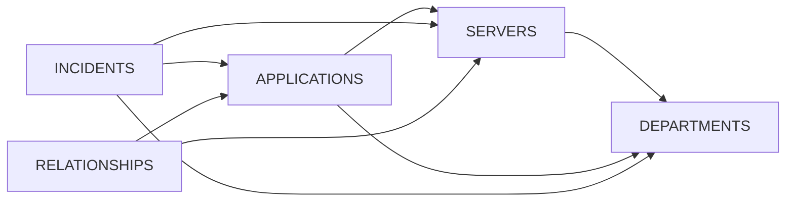

# Database Schema Documentation

## Overview

The Configuration Management Database (CMDB) is a comprehensive PostgreSQL schema designed to track enterprise IT infrastructure, applications, incidents, and their relationships. The schema supports complete asset lifecycle management with robust referential integrity and audit capabilities.

## Database Structure

### Entity Relationship Diagram

```mermaid
erDiagram
    DEPARTMENTS {
        int id PK
        varchar name UK
        varchar code UK
        varchar manager
        decimal budget
        varchar cost_center
        varchar location
        int employee_count
        timestamp created_at
        timestamp updated_at
    }
    
    SERVERS {
        int id PK
        varchar hostname UK
        inet ip_address
        varchar server_type
        varchar operating_system
        varchar os_version
        int cpu_cores
        int memory_gb
        int storage_gb
        varchar environment
        varchar status
        varchar location
        varchar datacenter
        varchar rack_position
        int department_id FK
        date purchase_date
        date warranty_expires
        decimal cost
        date last_patched
        timestamp created_at
        timestamp updated_at
        boolean monitored
        boolean backup_enabled
        text notes
    }
    
    APPLICATIONS {
        int id PK
        varchar name UK
        varchar version
        varchar app_type
        varchar programming_language
        varchar framework
        text description
        varchar business_criticality
        int server_id FK
        int department_id FK
        varchar owner_email
        varchar repository_url
        varchar documentation_url
        int port
        varchar url
        varchar environment
        varchar status
        boolean compliance_required
        boolean disaster_recovery
        int sla_tier
        decimal monthly_cost
        int user_count
        date last_deployment
        timestamp created_at
        timestamp updated_at
    }
    
    INCIDENTS {
        int id PK
        varchar incident_number UK
        varchar title
        text description
        varchar severity
        varchar status
        int server_id FK
        int application_id FK
        int department_id FK
        varchar reported_by
        varchar assigned_to
        timestamp reported_at
        timestamp resolved_at
        timestamp closed_at
        decimal resolution_time_hours
        text root_cause
        text resolution
        varchar impact
        int affected_users
        int downtime_minutes
        timestamp created_at
        timestamp updated_at
    }
    
    RELATIONSHIPS {
        int id PK
        varchar parent_type
        int parent_id
        varchar child_type
        int child_id
        varchar relationship_type
        text description
        varchar criticality
        timestamp created_at
    }
    
    AUDIT_LOG {
        int id PK
        varchar table_name
        int record_id
        varchar action
        varchar changed_by
        timestamp changed_at
        jsonb old_values
        jsonb new_values
    }
    
    DEPARTMENTS ||--o{ SERVERS : "owns"
    DEPARTMENTS ||--o{ APPLICATIONS : "owns"
    DEPARTMENTS ||--o{ INCIDENTS : "manages"
    SERVERS ||--o{ APPLICATIONS : "hosts"
    SERVERS ||--o{ INCIDENTS : "affects"
    APPLICATIONS ||--o{ INCIDENTS : "affects"
    RELATIONSHIPS ||--|| SERVERS : "relates"
    RELATIONSHIPS ||--|| APPLICATIONS : "relates"
```



## Table Definitions

### 1. DEPARTMENTS

**Purpose**: Organizational units within the enterprise

**Structure**:
```sql
CREATE TABLE departments (
    id SERIAL PRIMARY KEY,
    name VARCHAR(100) NOT NULL UNIQUE,
    code VARCHAR(20) NOT NULL UNIQUE,
    manager VARCHAR(100),
    budget DECIMAL(12, 2),
    cost_center VARCHAR(20),
    location VARCHAR(100),
    employee_count INTEGER DEFAULT 0,
    created_at TIMESTAMP DEFAULT CURRENT_TIMESTAMP,
    updated_at TIMESTAMP DEFAULT CURRENT_TIMESTAMP
);
```

**Key Fields**:
- `name`: Full department name (e.g., "Information Technology")
- `code`: Short department code (e.g., "IT")
- `budget`: Annual budget allocation
- `cost_center`: Financial tracking code
- `employee_count`: Number of employees in department

**Sample Data** (8 departments):
- Information Technology (IT) - 45 employees, $5M budget
- Finance (FIN) - 25 employees, $2M budget  
- Human Resources (HR) - 15 employees, $1.5M budget
- Sales (SALES) - 60 employees, $3M budget
- Marketing (MKT) - 30 employees, $2.5M budget
- Operations (OPS) - 80 employees, $4M budget
- Engineering (ENG) - 120 employees, $6M budget
- Customer Support (SUP) - 40 employees, $1.8M budget

**Business Rules**:
- Department names and codes must be unique
- Budget tracking at departmental level
- Supports cost center hierarchy

---

### 2. SERVERS

**Purpose**: Physical, virtual, and cloud infrastructure inventory

**Structure**:
```sql
CREATE TABLE servers (
    id SERIAL PRIMARY KEY,
    hostname VARCHAR(100) NOT NULL UNIQUE,
    ip_address INET NOT NULL,
    server_type VARCHAR(20) CHECK (server_type IN ('physical', 'virtual', 'cloud', 'container')),
    operating_system VARCHAR(100),
    os_version VARCHAR(50),
    cpu_cores INTEGER,
    memory_gb INTEGER,
    storage_gb INTEGER,
    environment VARCHAR(20) CHECK (environment IN ('production', 'staging', 'development', 'test', 'dr')),
    status VARCHAR(20) CHECK (status IN ('active', 'inactive', 'maintenance', 'decommissioned')),
    location VARCHAR(100),
    datacenter VARCHAR(50),
    rack_position VARCHAR(20),
    department_id INTEGER REFERENCES departments(id),
    purchase_date DATE,
    warranty_expires DATE,
    cost DECIMAL(10, 2),
    last_patched DATE,
    created_at TIMESTAMP DEFAULT CURRENT_TIMESTAMP,
    updated_at TIMESTAMP DEFAULT CURRENT_TIMESTAMP,
    monitored BOOLEAN DEFAULT true,
    backup_enabled BOOLEAN DEFAULT true,
    notes TEXT
);
```

**Indexes**:
- `idx_servers_status` - Query by server status
- `idx_servers_environment` - Filter by environment
- `idx_servers_department` - Departmental server lists

**Server Types**:
- **Physical**: Dedicated hardware servers
- **Virtual**: VMware/Hyper-V virtual machines
- **Cloud**: AWS/Azure/GCP instances  
- **Container**: Docker/Kubernetes containers

**Environments**:
- **Production**: Live systems serving users
- **Staging**: Pre-production testing environment
- **Development**: Developer workstations and test systems
- **Test**: Quality assurance testing environment
- **DR**: Disaster recovery environment

**Sample Data** (20 servers):
- Web servers: web-prod-01, web-prod-02, web-prod-03
- Database servers: db-prod-01, db-prod-02, db-prod-replica
- Application servers: app-prod-01, app-prod-02, app-prod-03
- Infrastructure: mail-server-01, backup-server-01, monitor-server-01
- Development: dev-server-01, dev-server-02, test-server-01
- Finance: fin-app-01, fin-db-01
- HR: hr-app-01
- Decommissioned: old-server-01

**Business Rules**:
- Hostnames must be unique across all environments
- IP addresses tracked for network management
- Warranty expiration monitoring
- Patch compliance tracking

---

### 3. APPLICATIONS

**Purpose**: Software applications and services inventory

**Structure**:
```sql
CREATE TABLE applications (
    id SERIAL PRIMARY KEY,
    name VARCHAR(100) NOT NULL,
    version VARCHAR(50),
    app_type VARCHAR(50) CHECK (app_type IN ('web', 'database', 'api', 'batch', 'middleware', 'monitoring')),
    programming_language VARCHAR(50),
    framework VARCHAR(50),
    description TEXT,
    business_criticality VARCHAR(20) CHECK (business_criticality IN ('critical', 'high', 'medium', 'low')),
    server_id INTEGER REFERENCES servers(id) ON DELETE SET NULL,
    department_id INTEGER REFERENCES departments(id),
    owner_email VARCHAR(100),
    repository_url VARCHAR(255),
    documentation_url VARCHAR(255),
    port INTEGER,
    url VARCHAR(255),
    environment VARCHAR(20) CHECK (environment IN ('production', 'staging', 'development', 'test')),
    status VARCHAR(20) CHECK (status IN ('active', 'inactive', 'deprecated', 'development')),
    compliance_required BOOLEAN DEFAULT false,
    disaster_recovery BOOLEAN DEFAULT false,
    sla_tier INTEGER CHECK (sla_tier IN (1, 2, 3, 4)),
    monthly_cost DECIMAL(10, 2),
    user_count INTEGER,
    last_deployment DATE,
    created_at TIMESTAMP DEFAULT CURRENT_TIMESTAMP,
    updated_at TIMESTAMP DEFAULT CURRENT_TIMESTAMP
);
```

**Indexes**:
- `idx_applications_server` - Applications by server
- `idx_applications_department` - Applications by department
- `idx_applications_criticality` - Business critical applications
- `idx_applications_status` - Active/inactive applications
- `ux_applications_name` - Unique application names

**Application Types**:
- **Web**: User-facing web applications
- **Database**: Database management systems
- **API**: REST/GraphQL API services
- **Batch**: Scheduled/background processing
- **Middleware**: Integration and messaging
- **Monitoring**: System monitoring and alerting

**Business Criticality Levels**:
- **Critical**: Mission-critical, immediate response required
- **High**: Important business functions, high priority
- **Medium**: Standard business applications
- **Low**: Nice-to-have, low impact applications

**SLA Tiers**:
- **Tier 1**: 99.99% uptime, 24/7 support, <1 hour response
- **Tier 2**: 99.9% uptime, business hours support, <4 hour response  
- **Tier 3**: 99% uptime, business hours support, <1 day response
- **Tier 4**: Best effort, limited support

**Sample Data** (21 applications):
- **Critical**: Corporate Website, E-Commerce Platform, Customer Database, ERP System, Payroll System
- **High**: HRIS, Service Desk, Monitoring Dashboard, Business Intelligence
- **Medium**: Expense Tracker, Recruitment Portal, Team Chat
- **Infrastructure**: Backup Manager, Email Server, CI/CD Pipeline, Code Repository
- **Analytics**: Data Warehouse, Analytics API
- **Deprecated**: Legacy System

**Business Rules**:
- Application names must be unique within the system
- Server relationships allow null (for cloud-hosted or external services)
- Cost tracking supports financial planning
- Deployment tracking for change management

---

### 4. INCIDENTS

**Purpose**: IT service management and issue tracking

**Structure**:
```sql
CREATE TABLE incidents (
    id SERIAL PRIMARY KEY,
    incident_number VARCHAR(20) UNIQUE NOT NULL,
    title VARCHAR(200) NOT NULL,
    description TEXT,
    severity VARCHAR(20) CHECK (severity IN ('critical', 'high', 'medium', 'low')),
    status VARCHAR(20) CHECK (status IN ('open', 'in_progress', 'resolved', 'closed', 'cancelled')),
    server_id INTEGER REFERENCES servers(id) ON DELETE SET NULL,
    application_id INTEGER REFERENCES applications(id) ON DELETE SET NULL,
    department_id INTEGER REFERENCES departments(id),
    reported_by VARCHAR(100),
    assigned_to VARCHAR(100),
    reported_at TIMESTAMP DEFAULT CURRENT_TIMESTAMP,
    resolved_at TIMESTAMP,
    closed_at TIMESTAMP,
    resolution_time_hours DECIMAL(8, 2),
    root_cause TEXT,
    resolution TEXT,
    impact VARCHAR(20) CHECK (impact IN ('enterprise', 'department', 'team', 'individual')),
    affected_users INTEGER,
    downtime_minutes INTEGER,
    created_at TIMESTAMP DEFAULT CURRENT_TIMESTAMP,
    updated_at TIMESTAMP DEFAULT CURRENT_TIMESTAMP
);
```

**Indexes**:
- `idx_incidents_status` - Open/closed incident queries
- `idx_incidents_severity` - Priority-based routing
- `idx_incidents_server` - Server-specific incidents
- `idx_incidents_application` - Application-specific incidents
- `idx_incidents_reported_at` - Time-based reporting

**Incident Severities**:
- **Critical**: Complete service outage, immediate response required
- **High**: Major functionality impacted, urgent response needed
- **Medium**: Partial functionality affected, standard response
- **Low**: Minor issues, low priority

**Incident Status Workflow**:
1. **Open**: Newly reported incident
2. **In Progress**: Work has begun on resolution
3. **Resolved**: Issue fixed, pending verification
4. **Closed**: Incident completed and verified
5. **Cancelled**: Invalid or duplicate incident

**Impact Levels**:
- **Enterprise**: Affects entire organization
- **Department**: Affects specific department
- **Team**: Affects small team or group
- **Individual**: Affects single user

**Sample Data** (20 incidents):
- **Critical**: Database connection pool exhausted, Website 500 errors, Payment service timeouts
- **High**: Email delays, ERP performance issues, SSL certificate expiring, CI/CD failures
- **Medium**: Backup failures, test server access, report generation errors, memory leaks
- **Low**: Printer issues, password resets, software installation requests

**Metrics Tracked**:
- Resolution time in hours
- Downtime in minutes
- Number of affected users
- Root cause analysis
- Resolution documentation

---

### 5. RELATIONSHIPS

**Purpose**: Track dependencies and connections between infrastructure and applications

**Structure**:
```sql
CREATE TABLE relationships (
    id SERIAL PRIMARY KEY,
    parent_type VARCHAR(20) CHECK (parent_type IN ('server', 'application')),
    parent_id INTEGER NOT NULL,
    child_type VARCHAR(20) CHECK (child_type IN ('server', 'application')),
    child_id INTEGER NOT NULL,
    relationship_type VARCHAR(50) CHECK (relationship_type IN (
        'depends_on', 'hosts', 'connects_to', 'uses', 'backs_up', 
        'load_balances', 'replicates_to', 'monitors'
    )),
    description TEXT,
    criticality VARCHAR(20) CHECK (criticality IN ('critical', 'high', 'medium', 'low')),
    created_at TIMESTAMP DEFAULT CURRENT_TIMESTAMP,
    UNIQUE(parent_type, parent_id, child_type, child_id, relationship_type)
);
```

**Relationship Types**:
- **depends_on**: Service dependencies (app depends on database)
- **hosts**: Hosting relationships (server hosts application)
- **connects_to**: Network connections (app connects to service)
- **uses**: Resource usage (app uses shared service)
- **backs_up**: Backup relationships (backup server backs up data)
- **load_balances**: Load balancing (traffic distributed between servers)
- **replicates_to**: Data replication (primary to secondary)
- **monitors**: Monitoring relationships (monitor server watches services)

**Sample Relationships** (20+ relationships):
- Web applications depend on customer database
- Database servers replicate to DR site
- Load balancing between web servers
- Monitoring server monitors all critical systems
- Backup server backs up databases
- Applications hosted on specific servers

**Business Rules**:
- Unique constraint prevents duplicate relationships
- Supports both server-to-server and application-to-application dependencies
- Criticality helps prioritize impact analysis
- Bidirectional relationships require two records

---

### 6. AUDIT_LOG

**Purpose**: Track all changes to critical data for compliance and forensics

**Structure**:
```sql
CREATE TABLE audit_log (
    id SERIAL PRIMARY KEY,
    table_name VARCHAR(50) NOT NULL,
    record_id INTEGER NOT NULL,
    action VARCHAR(20) CHECK (action IN ('insert', 'update', 'delete')),
    changed_by VARCHAR(100),
    changed_at TIMESTAMP DEFAULT CURRENT_TIMESTAMP,
    old_values JSONB,
    new_values JSONB
);
```

**Indexes**:
- `idx_audit_log_table` - Queries by table and record
- `idx_audit_log_changed_at` - Time-based audit queries

**Features**:
- JSONB storage for flexible schema evolution
- Complete before/after value tracking
- User attribution for all changes
- Timestamp precision for forensics

## Views and Functions

### Predefined Views

#### server_overview
```sql
CREATE VIEW server_overview AS
SELECT 
    s.hostname,
    s.ip_address,
    s.server_type,
    s.environment,
    s.status,
    d.name as department,
    COUNT(DISTINCT a.id) as app_count,
    COUNT(DISTINCT i.id) as incident_count
FROM servers s
LEFT JOIN departments d ON s.department_id = d.id
LEFT JOIN applications a ON a.server_id = s.id
LEFT JOIN incidents i ON i.server_id = s.id
GROUP BY s.id, s.hostname, s.ip_address, s.server_type, s.environment, s.status, d.name;
```

#### application_health
```sql
CREATE VIEW application_health AS
SELECT 
    a.name as application,
    a.version,
    a.business_criticality,
    a.status,
    s.hostname as server,
    d.name as department,
    COUNT(i.id) as total_incidents,
    COUNT(CASE WHEN i.status IN ('open', 'in_progress') THEN 1 END) as open_incidents
FROM applications a
LEFT JOIN servers s ON a.server_id = s.id
LEFT JOIN departments d ON a.department_id = d.id
LEFT JOIN incidents i ON i.application_id = a.id
GROUP BY a.id, a.name, a.version, a.business_criticality, a.status, s.hostname, d.name;
```

#### department_summary
```sql
CREATE VIEW department_summary AS
SELECT 
    d.name as department,
    d.code,
    COUNT(DISTINCT s.id) as server_count,
    COUNT(DISTINCT a.id) as application_count,
    COUNT(DISTINCT i.id) as incident_count,
    SUM(s.cost) as total_server_cost,
    SUM(a.monthly_cost) * 12 as annual_app_cost
FROM departments d
LEFT JOIN servers s ON s.department_id = d.id
LEFT JOIN applications a ON a.department_id = d.id
LEFT JOIN incidents i ON i.department_id = d.id
GROUP BY d.id, d.name, d.code;
```

### Utility Functions

#### get_incident_metrics
```sql
CREATE OR REPLACE FUNCTION get_incident_metrics(
    start_date DATE DEFAULT CURRENT_DATE - INTERVAL '30 days',
    end_date DATE DEFAULT CURRENT_DATE
)
RETURNS TABLE (
    total_incidents BIGINT,
    avg_resolution_hours NUMERIC,
    critical_incidents BIGINT,
    total_downtime_hours NUMERIC
) AS $$
BEGIN
    RETURN QUERY
    SELECT 
        COUNT(*) as total_incidents,
        AVG(resolution_time_hours) as avg_resolution_hours,
        COUNT(CASE WHEN severity = 'critical' THEN 1 END) as critical_incidents,
        SUM(downtime_minutes) / 60.0 as total_downtime_hours
    FROM incidents
    WHERE reported_at BETWEEN start_date AND end_date;
END;
$$ LANGUAGE plpgsql;
```

### Triggers

#### Auto-Update Timestamps
```sql
CREATE OR REPLACE FUNCTION update_updated_at()
RETURNS TRIGGER AS $$
BEGIN
    NEW.updated_at = CURRENT_TIMESTAMP;
    RETURN NEW;
END;
$$ LANGUAGE plpgsql;

-- Applied to all main tables
CREATE TRIGGER update_servers_updated_at BEFORE UPDATE ON servers
    FOR EACH ROW EXECUTE FUNCTION update_updated_at();
```

## Data Integrity

### Foreign Key Constraints



### Check Constraints

- **Enumerated Values**: Status, environment, severity fields use CHECK constraints
- **Positive Values**: Costs, counts, and metrics must be positive
- **Date Ranges**: Purchase dates must be reasonable
- **Email Format**: Email addresses validated (future enhancement)

### Unique Constraints

- **Hostnames**: Must be unique across all servers
- **Incident Numbers**: Sequential numbering system
- **Department Codes**: Short codes for easy reference
- **Application Names**: Prevent naming conflicts

## Query Patterns

### Common Queries

#### Infrastructure Summary
```sql
SELECT 
    environment,
    server_type,
    COUNT(*) as server_count,
    SUM(cpu_cores) as total_cpu,
    SUM(memory_gb) as total_memory,
    SUM(cost) as total_cost
FROM servers
WHERE status = 'active'
GROUP BY environment, server_type
ORDER BY environment, server_type;
```

#### Application Portfolio by Criticality
```sql
SELECT 
    business_criticality,
    app_type,
    COUNT(*) as app_count,
    SUM(monthly_cost) as monthly_cost,
    AVG(user_count) as avg_users
FROM applications
WHERE status = 'active'
GROUP BY business_criticality, app_type
ORDER BY business_criticality, app_count DESC;
```

#### Incident Analysis
```sql
SELECT 
    DATE_TRUNC('month', reported_at) as month,
    severity,
    COUNT(*) as incident_count,
    AVG(resolution_time_hours) as avg_resolution,
    SUM(affected_users) as total_affected
FROM incidents
WHERE reported_at >= CURRENT_DATE - INTERVAL '1 year'
GROUP BY DATE_TRUNC('month', reported_at), severity
ORDER BY month, severity;
```

#### Dependency Impact Analysis
```sql
WITH RECURSIVE dependency_tree AS (
    -- Find all systems that depend on a specific component
    SELECT parent_type, parent_id, child_type, child_id, 1 as depth
    FROM relationships 
    WHERE parent_type = 'application' AND parent_id = 1
    
    UNION ALL
    
    SELECT r.parent_type, r.parent_id, r.child_type, r.child_id, dt.depth + 1
    FROM relationships r
    JOIN dependency_tree dt ON r.parent_type = dt.child_type AND r.parent_id = dt.child_id
    WHERE dt.depth < 5  -- Prevent infinite loops
)
SELECT * FROM dependency_tree;
```

## Performance Considerations

### Indexing Strategy

- **Primary Keys**: Automatic B-tree indexes
- **Foreign Keys**: Indexes on all FK columns for join performance  
- **Status Fields**: Indexes on frequently filtered enum values
- **Timestamps**: Indexes for date range queries
- **Search Fields**: Consider full-text search indexes for descriptions

### Partitioning Opportunities

- **Incidents**: Partition by month for historical data management
- **Audit Log**: Partition by date for compliance retention
- **Large Tables**: Consider partitioning when tables exceed 10M rows

### Query Optimization

- **Views**: Pre-computed aggregations for dashboard queries
- **Materialized Views**: Consider for expensive analytical queries
- **Statistics**: Ensure PostgreSQL statistics are current
- **Connection Pooling**: Use pgBouncer for high-concurrency scenarios

This schema provides a robust foundation for comprehensive IT asset management with full relationship tracking, incident management, and audit capabilities.