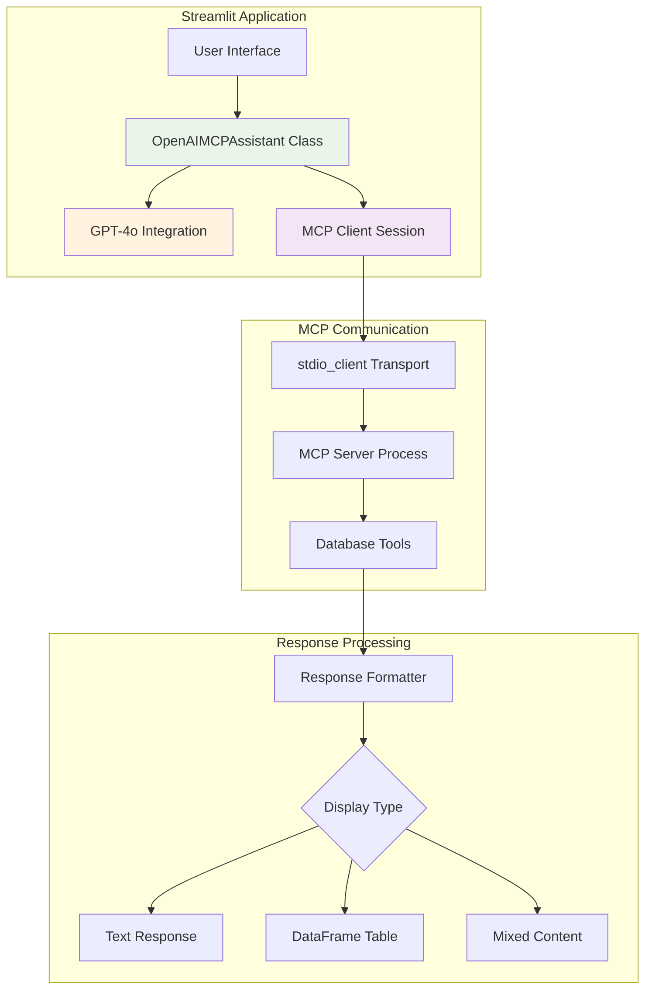
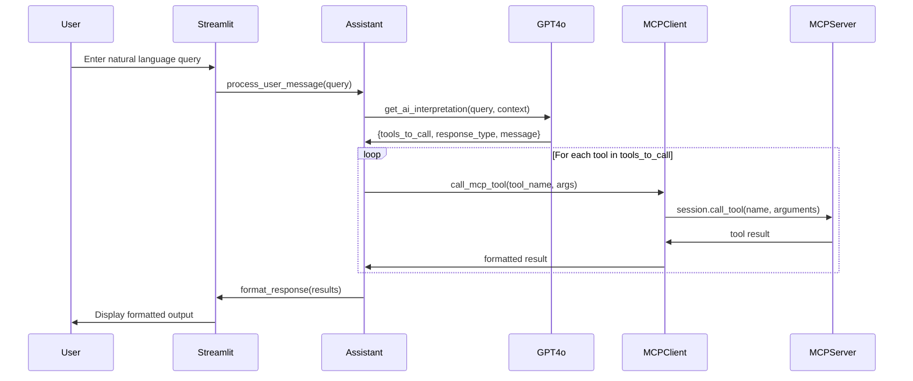

# MCP Client Documentation

## Overview

The MCP Client is implemented as part of the Streamlit application (`streamlit_openai_mcp.py`) and provides the interface between the web UI and the PostgreSQL MCP Server. It orchestrates communication between OpenAI's GPT-4o for natural language processing and the MCP server for database operations.

## Architecture

### Client Components



## Core Classes

### OpenAIMCPAssistant

The central orchestrator class that manages all client-side operations.

```python
class OpenAIMCPAssistant:
    def __init__(self):
        self.server_path = "postgres_mcp_server.py"
        self.conversation_history = []
```

**Key Responsibilities**:
- Maintain conversation history for context
- Coordinate between GPT-4o and MCP server
- Format responses for optimal display
- Handle error conditions gracefully

## Communication Flow

### Request Processing Sequence



### MCP Session Management

The client establishes and manages MCP sessions using the official MCP client library:

```python
async def call_mcp_tool(self, tool_name: str, arguments: Dict[str, Any]) -> str:
    """Call an MCP tool and return the result."""
    server_params = StdioServerParameters(
        command=sys.executable,
        args=[self.server_path],
        env=os.environ.copy()
    )
    
    try:
        async with stdio_client(server_params) as (read, write):
            async with ClientSession(read, write) as session:
                await session.initialize()
                result = await session.call_tool(tool_name, arguments)
                
                if result.content and len(result.content) > 0:
                    return result.content[0].text
                return "No result returned"
    except Exception as e:
        return f"Error calling tool: {str(e)}"
```

**Session Lifecycle**:
1. **Process Creation**: Spawns MCP server as subprocess
2. **Transport Setup**: Establishes stdio communication channel
3. **Session Initialization**: Performs MCP protocol handshake
4. **Tool Execution**: Calls specific database tools
5. **Cleanup**: Automatically closes session and process

## GPT-4o Integration

### System Prompt Design

The client uses a carefully crafted system prompt to guide GPT-4o's interpretation of user queries:

```python
SYSTEM_PROMPT = """You are a helpful database assistant that helps users query a PostgreSQL database.
You have access to the following MCP tools:

1. list_tables(schema="public") - Lists all tables in the database
2. describe_table(table_name, schema="public") - Shows the schema/structure of a table
3. read_table(table_name, schema="public", limit=100, offset=0) - Reads data from a table
4. search_tables(search_term, schema="public") - Searches for tables/columns by name
5. get_table_stats(table_name, schema="public") - Gets statistics about a table
6. execute_query(query, limit=100) - Executes a SELECT SQL query

Based on the user's request, determine which tool(s) to call and with what parameters.
Respond with a JSON object containing:
{
    "thoughts": "Your reasoning about what the user wants",
    "tools_to_call": [
        {
            "tool": "tool_name",
            "arguments": {
                "param1": "value1",
                "param2": "value2"
            }
        }
    ],
    "response_type": "text|dataframe|mixed",
    "user_facing_message": "What you'll tell the user before showing results"
}
```

### Context Management

The assistant maintains conversation context to improve query interpretation:

```python
def get_ai_interpretation(self, user_message: str, context: List[Dict] = None) -> Dict:
    """Use GPT-4o to interpret the user's request."""
    messages = [{"role": "system", "content": SYSTEM_PROMPT}]
    
    # Add conversation history for context (last 5 messages)
    if context:
        for msg in context[-5:]:
            if msg["role"] == "user":
                messages.append({"role": "user", "content": msg["content"]})
            elif msg["role"] == "assistant" and isinstance(msg["content"], str):
                messages.append({
                    "role": "assistant", 
                    "content": msg["content"][:500]  # Truncate long responses
                })
```

**Context Features**:
- **History Limit**: Last 5 conversation turns to prevent token overflow
- **Response Truncation**: Long responses summarized to preserve context
- **Role Preservation**: Maintains user/assistant conversation flow
- **Token Management**: Balances context depth with API limits

### Response Parsing

GPT-4o responses are parsed as structured JSON:

```python
response = openai_client.chat.completions.create(
    model="gpt-4o",
    messages=messages,
    temperature=0.1,  # Low temperature for consistency
    response_format={"type": "json_object"}
)

ai_response = json.loads(response.choices[0].message.content)
```

**Parsed Structure**:
- `thoughts`: GPT-4o's reasoning process (for debugging)
- `tools_to_call`: Array of tools with parameters
- `response_type`: Display format hint ("text", "dataframe", "mixed")
- `user_facing_message`: Explanation for the user

## Response Formatting

### Format Types

The client supports three primary response formats:

#### 1. Text Response
For schema information, error messages, and general queries:
```python
{
    "type": "text",
    "content": "Formatted text content with line breaks and structure"
}
```

#### 2. DataFrame Response  
For tabular data that benefits from structured display:
```python
{
    "type": "dataframe",
    "message": "Explanation message",
    "content": pandas_dataframe,
    "metadata": {
        "table": "public.servers",
        "total_rows": 20,
        "returned_rows": 10,
        "query": "SELECT * FROM servers..."
    }
}
```

#### 3. Mixed Response
For queries returning multiple tool results:
```python
{
    "type": "mixed",
    "content": "Text explanation",
    "dataframes": [
        {
            "df": pandas_dataframe,
            "metadata": {"tool": "read_table", "table": "servers"}
        }
    ]
}
```

### JSON to DataFrame Conversion

The client automatically detects JSON responses containing tabular data:

```python
def format_response(self, message: str, results: List[Dict], response_type: str) -> Dict[str, Any]:
    """Format the results for display."""
    try:
        data = json.loads(result["result"])
        if isinstance(data, dict) and "data" in data and data["data"]:
            df = pd.DataFrame(data["data"])
            return {
                "type": "dataframe",
                "message": message,
                "content": df,
                "metadata": {
                    "table": data.get("table"),
                    "total_rows": data.get("total_rows"),
                    "returned_rows": data.get("returned_rows"),
                    "query": data.get("query")
                }
            }
    except (json.JSONDecodeError, KeyError):
        # Fall back to text display
        pass
```

## User Interface Integration

### Streamlit Components

The client integrates with various Streamlit UI components:

#### Chat Interface
```python
# Display messages with role-based styling
for message in st.session_state.messages:
    with st.chat_message(message["role"]):
        # Handle different response types
        if isinstance(message["content"], dict):
            msg_type = message["content"].get("type")
            
            if msg_type == "dataframe":
                # Display DataFrame with metadata
                st.dataframe(df, use_container_width=True)
                # Add download button
                csv = df.to_csv(index=False)
                st.download_button("📥 Download CSV", csv, "results.csv")
```

#### Metadata Display
```python
if metadata:
    cols = st.columns(4)
    if "table" in metadata:
        cols[0].metric("Table", metadata["table"])
    if "total_rows" in metadata:
        cols[1].metric("Total Rows", f"{metadata['total_rows']:,}")
    if "returned_rows" in metadata:
        cols[2].metric("Showing", metadata["returned_rows"])
```

#### Example Queries
```python
examples = [
    "What tables do I have?",
    "Describe the users table",
    "Show me 5 rows from products",
    "How many orders were placed this month?",
    "Find tables with customer data",
    "What's the average order value?"
]

for example in examples:
    if st.button(f"→ {example}", key=f"ex_{example}"):
        st.session_state.example = example
```

### Error Handling in UI

The client provides comprehensive error handling with user-friendly messages:

```python
try:
    # OpenAI API call
    response = openai_client.chat.completions.create(...)
    ai_response = json.loads(response.choices[0].message.content)
    return ai_response
except Exception as e:
    st.error(f"OpenAI Error: {str(e)}")
    return {
        "thoughts": f"Error interpreting request: {str(e)}",
        "tools_to_call": [],
        "response_type": "text",
        "user_facing_message": "I encountered an error understanding your request. Please try rephrasing."
    }
```

## Configuration Management

### Environment Variable Handling

The client reads configuration from environment variables:

```python
# OpenAI configuration
openai_client = OpenAI(api_key=os.getenv("OPENAI_API_KEY"))

# Database configuration (passed to MCP server)
server_params = StdioServerParameters(
    command=sys.executable,
    args=[self.server_path],
    env=os.environ.copy()  # Pass all environment variables
)
```

### Session State Management

Streamlit session state maintains application state:

```python
# Initialize session state
if "messages" not in st.session_state:
    st.session_state.messages = []
    st.session_state.messages.append({
        "role": "assistant",
        "content": "Welcome message..."
    })

if "assistant" not in st.session_state:
    st.session_state.assistant = OpenAIMCPAssistant()
```

**State Components**:
- `messages`: Conversation history
- `assistant`: MCP assistant instance
- `example`: Currently selected example query
- Configuration flags and user preferences

## Performance Optimization

### Async Operation Management

The client handles async operations efficiently:

```python
# Process user message asynchronously
response = asyncio.run(
    st.session_state.assistant.process_user_message(
        prompt,
        st.session_state.messages
    )
)
```

### Resource Management

- **Process Lifecycle**: MCP server processes are created per request and cleaned up automatically
- **Memory Management**: Large DataFrames are displayed efficiently with Streamlit's native components
- **Connection Pooling**: Handled by the MCP server, not the client

### Caching Strategy

```python
@st.cache_data
def process_query_cache(query_hash, message_hash):
    """Cache expensive operations when appropriate"""
    # Implementation for caching expensive AI operations
```

## Error Recovery

### Connection Failures

```python
async def call_mcp_tool(self, tool_name: str, arguments: Dict[str, Any]) -> str:
    try:
        # MCP communication
        async with stdio_client(server_params) as (read, write):
            # ... session logic
    except Exception as e:
        return f"Error calling tool: {str(e)}"
```

### Retry Logic

The client implements basic retry logic for transient failures:

```python
max_retries = 3
for attempt in range(max_retries):
    try:
        result = await session.call_tool(tool_name, arguments)
        break
    except Exception as e:
        if attempt == max_retries - 1:
            raise
        await asyncio.sleep(2 ** attempt)  # Exponential backoff
```

## Debugging Features

### AI Reasoning Display

The client includes an expandable section showing GPT-4o's reasoning:

```python
with st.expander("🤖 AI Reasoning", expanded=False):
    st.json(ai_interpretation)
```

This helps developers understand how natural language queries are interpreted and can be disabled in production.

### Conversation Export

Users can export conversation history for analysis:

```python
conversation_data = {
    "timestamp": datetime.now().isoformat(),
    "messages": st.session_state.messages
}

st.download_button(
    "Export Conversation",
    json.dumps(conversation_data, indent=2),
    "conversation.json",
    "application/json"
)
```

## Security Considerations

### API Key Management

- OpenAI API keys are loaded from environment variables
- No hardcoded credentials in source code
- Optional runtime API key input (not recommended for production)

### Input Validation

- User queries are processed through GPT-4o before reaching the database
- MCP server enforces additional validation and security controls
- No direct SQL injection vectors from the client

### Process Isolation

- MCP server runs in a separate process with isolated environment
- stdio transport provides secure inter-process communication
- No shared memory or file system access

This MCP client provides a robust, user-friendly interface for AI-powered database interactions while maintaining security, performance, and extensibility.